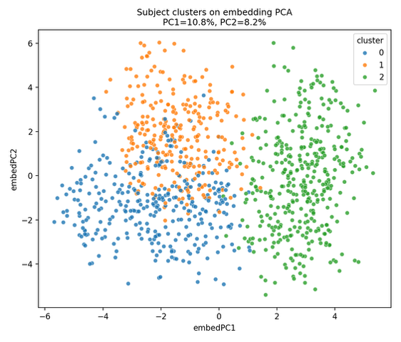
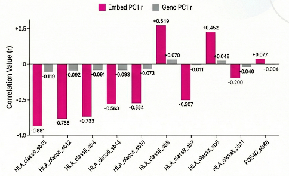
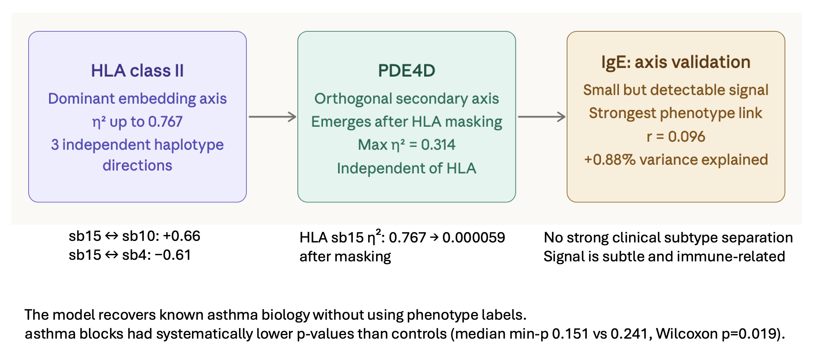

# Block-Based Genotype Embedding Analysis

Unsupervised learning of subject-level genomic representations from LD-aware blocks,
with application to asthma-relevant loci and downstream phenotype association.


*Phase 1 learns a compact β-VAE embedding per LD block. Phase 2 aggregates block
embeddings across the genome via a Transformer with cross-block attention, producing
subject-level embeddings and interpretable block-importance weights.*

---

## Key Idea

Standard genotype analysis treats each SNP independently or applies global LD pruning,
losing local genomic context. This project takes a hierarchical approach:

1. **Phase 1 — Per-block β-VAE.** Each LD block is encoded independently into a
   low-dimensional latent vector that captures local haplotype structure.
2. **Phase 2 — Cross-block Transformer.** A Transformer aggregates all block embeddings
   into a single subject-level representation. Learned attention weights identify which
   blocks are most informative for organizing genetic variation across individuals.

The result is an embedding that is biologically interpretable (attention scores), within same ancestry, and structured for downstream analysis (clustering, phenotype association, leave-one-block-out validation).

---

## Key Results

- **HLA class II dominates the learned space.** Transformer attention weights
  consistently rank HLA class II blocks highest; these blocks drive the primary
  axis of subject-level variation.
- **HLA block embeddings outperform ancestry PCs.** HLA block_PC1 explains subject
  cluster structure beyond what genotype PC1–10 can account for, confirming genuine
  biological signal rather than ancestry confounding.
- **PDE4D emerges after masking HLA.** A leave-HLA-out re-clustering experiment
  (script `11_leave_hla_out.py`) reveals PDE4D as the next most structurally
  informative block — consistent with its established role in asthma and β-agonist
  pharmacogenomics.
- **Phenotype signal is real but subtle; IgE is the strongest.** Continuous phenotypes
  (log10 blood eosinophil count, IgE proxy G19B) show the most consistent association
  with block-level PC features across subjects.
- **Biology recovered without phenotype labels.** The model was trained unsupervised on
  genotype data only. The emergence of HLA class II and PDE4D in post-hoc analysis
  validates that the learned geometry reflects known asthma biology.

---

## Recommended Figures

### 1 — Pipeline architecture


Schematic of the two-phase architecture: per-block VAE (Phase 1) feeding into the
cross-block Transformer (Phase 2) to produce subject embeddings (shown above).


---


### 2 — Subject embedding PCA reveals stable genomic structure



PCA of Phase 2 subject embeddings reveals three reproducible strata (`k=3`; ARI = 0.999).
The weak silhouette score (`0.139`) indicates the learned space is structured as a
continuous gradient rather than sharply separated clinical subtypes.

*Source: `scripts/analysis/09_unsupervised_subject_cluster_analysis.py`. 
Filename: `docs/images/subject_pca_clusters.png`*

---

### 3 — HLA class II dominance



HLA class II subblocks strongly organize the Phase 2 embedding space. HLA sb15 explains
far more cluster variance than ancestry PCs (η² = 0.767 vs 0.051 for genotype PC3) and
correlates strongly with the main embedding axis (EmbedPC1 r = −0.88).
*Source: `scripts/analysis/10_hla_cluster_analysis.py` and
`scripts/analysis/09_unsupervised_subject_cluster_analysis.py`. 

---

### 4 — Three-finding summary



Slide-style summary panel: (1) HLA class II anchors the embedding space, (2) PDE4D
is the next signal after HLA removal, (3) phenotype associations are present and
biologically coherent without supervised training.
*Source: conclusions/summary slide. Suggested filename:
`docs/images/findings_summary.png`*

---

## Repository Structure

```
scripts/
  core/       Core pipeline — Phase 1 VAE, Phase 2 Transformer, block analysis, plotting
  analysis/   Post-hoc interpretation, validation, and figure generation
  archive/    Superseded wrappers, exploratory one-offs, debug scripts
configs/      YAML configs for Phase 1 and Phase 2
data/         Genotype block files and block manifest (not version-controlled if restricted)
results/      Pipeline outputs (embeddings, clustering, association tables, figures)
docs/         Notes, method descriptions, and figures for README
metadata/     Phenotype table, eigenvec file, subject lists
environment.yml
WORKFLOW.md   Step-by-step execution guide with CLI examples
```

See [WORKFLOW.md](WORKFLOW.md) for full CLI instructions, expected inputs/outputs per
step, and execution order.

---

## Quick Start

```bash
conda env create -f environment.yml
conda activate genotype-embedding-env

# Phase 1 — per-block VAE
python scripts/core/VAE_phase1.py --config configs/config_phase1.yaml

# Phase 2 — cross-block attention
python scripts/core/attention_phase2.py --config configs/config_phase2.yaml

# Post-hoc analysis (example)
python scripts/analysis/11_leave_hla_out.py
```

Use `--dry-run` on either Phase 1 or Phase 2 to validate inputs without running training.
Full details in [WORKFLOW.md](WORKFLOW.md).

---

## Data

Raw genotype data and phenotype tables are not version-controlled (access-restricted).
The repository preserves analysis logic, configuration, derived summaries, and
documentation sufficient for rerunning with appropriate input access.

Core inputs: per-block `.npy` genotype matrices, block manifest TSV,
subject phenotype CSV, ancestry eigenvec file.

---

## Environment

Python 3.10+. Key dependencies: `torch`, `numpy`, `pandas`, `scikit-learn`,
`matplotlib`, `umap-learn`, `hdbscan`, `statsmodels`, `scipy`, `seaborn`, `yaml`.

```bash
conda env create -f environment.yml
```
